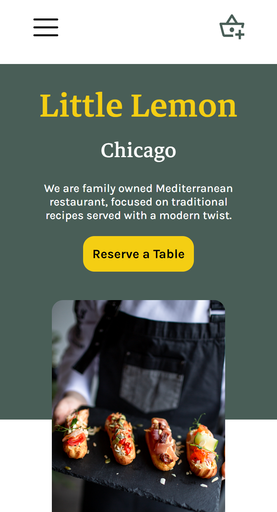
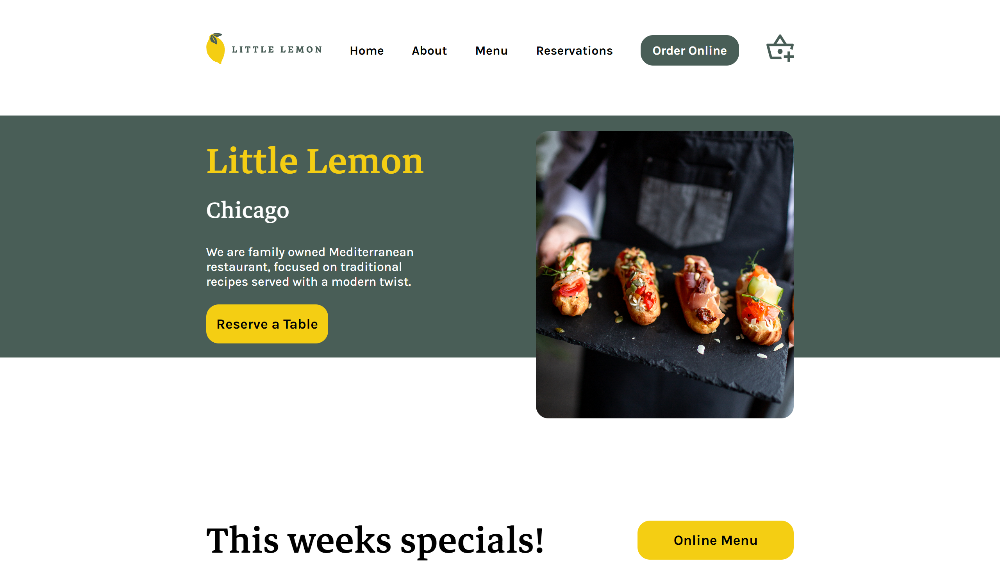

<h1 align="center"> Little Lemon  </h1>

The little lemon app is the capstone project for Meta's Front-End Developer Certificate on Coursera.  

  <a href="#live">Live</a>&nbsp;&nbsp;&nbsp;|&nbsp;&nbsp;&nbsp;
  <a href="#technologies">Technologies</a>&nbsp;&nbsp;&nbsp;|&nbsp;&nbsp;&nbsp;
  <a href="#license">License</a>

  

<table>
  <tbody>
    <tr>
      <td>
        
      </td>
      <td>
        
      </td>
    </tr>
  </tbody>
</table>

<h2 id="live">👁️‍🗨️ Live</h2>

This project is hosted at Github Pages of this repository by the link <a href="https://leonardojacomussi.github.io/little-lemon/" target="_blank">https://leonardojacomussi.github.io/little-lemon/</a>

<h2 id="technologies">🚀 Technologies</h2>

This project was developed with the following technologies:

- React JS
- Typescript
- Styled Components
- Yup
- Formik
- Jest
- React Testing Library
- Git and Github
- Figma

<h2 id="license">📜 License</h2>

This project is under the MIT license.
